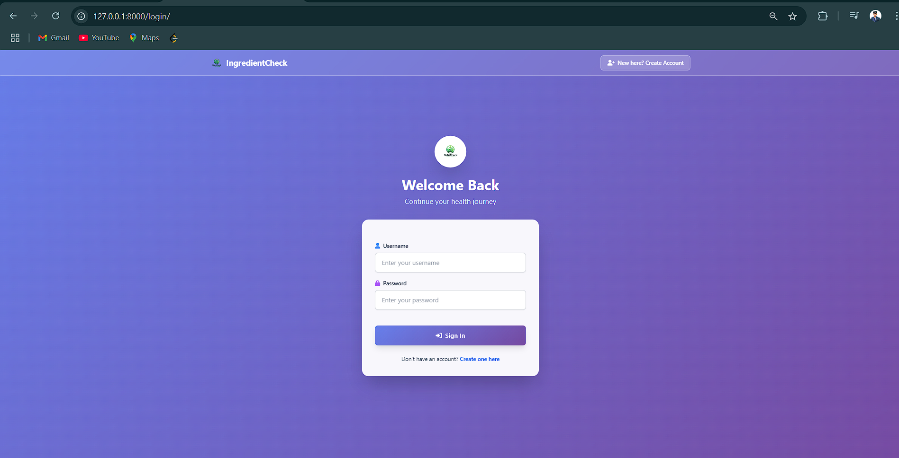
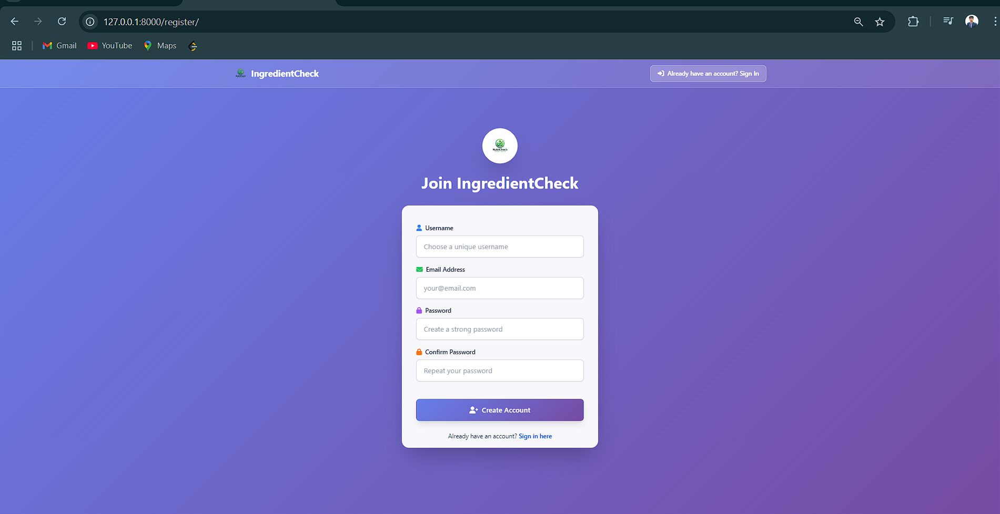
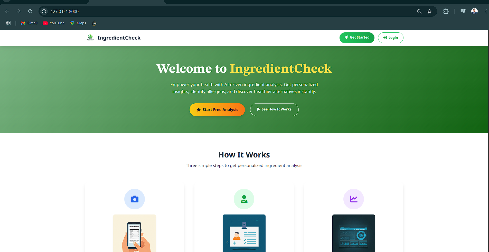
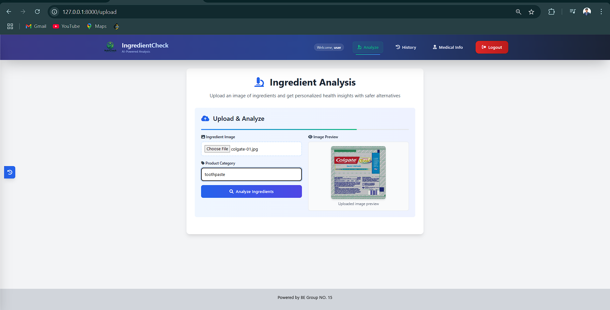
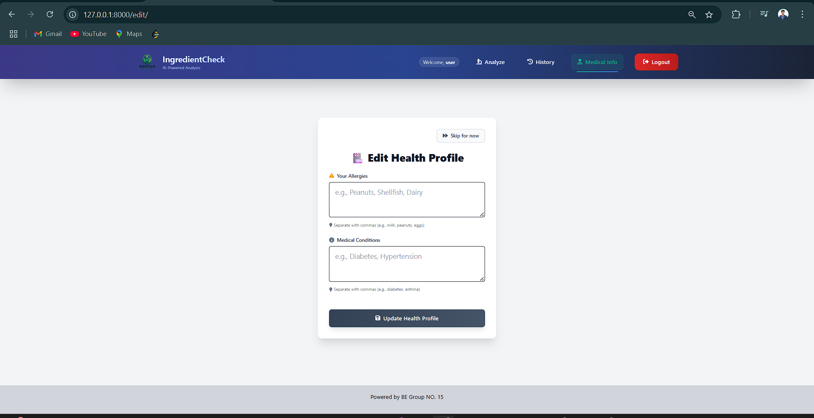
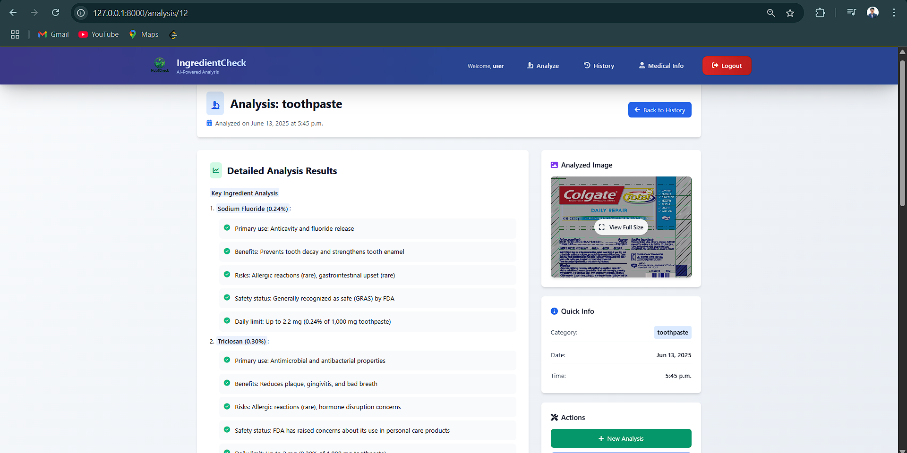

# 🧠 Smart Ingredient Analyzer

A Django-based web application that extracts and analyzes ingredient information from product labels using OCR and AI.

---

## 📌 Project Overview

Smart Ingredient Analyzer leverages **OCR technology** to extract ingredient data from images of product labels and uses a **Large Language Model (LLM)** to analyze and suggest healthier or preference-based ingredient alternatives.

---

## 🧰 Technologies Used

- **Python**
- **Django Framework**
- **OCR (Optical Character Recognition)**
- **Large Language Model (LLM) Integration**
- **Jinja2 Templating Engine**

---

## 🔍 Features

- 📷 Upload images of labels to extract ingredients via OCR (Paddle OCR)
- 🧠 Analyze ingredients with insights and health relevance
- 🔄 Suggest alternative ingredients via LLM (e.g., llamma-8b-8192)
- 💡 Personalized recommendations based on allergies or preferences
- 🌐 Dynamic, user-friendly interface using Jinja templating with tailwind CSS

---

## 🖼️ Screenshots

- **Login Page**
  - 
- **Registration Page**
  - 
- **Home Page**
  - 
- **Analysis Page**
  - 
- **Allergies Page**
  - 
- **Analysis Results**
  - 
- **Histories**
  - 

---

## ⚙️ Installation

### 1. Clone the Repository

```bash
git clone https://github.com/vikas1899/smart-ingredient-analyzer.git
cd smart-ingredient-analyzer
```
